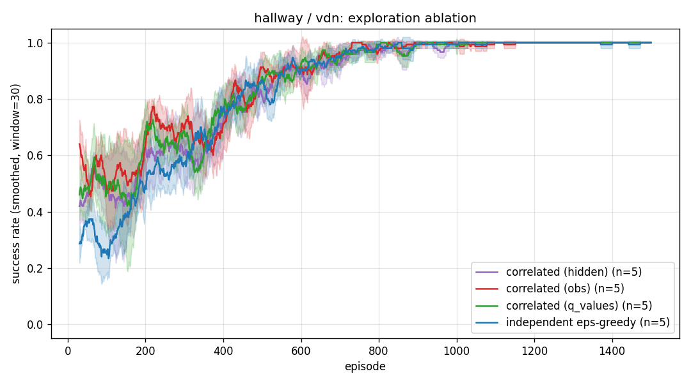
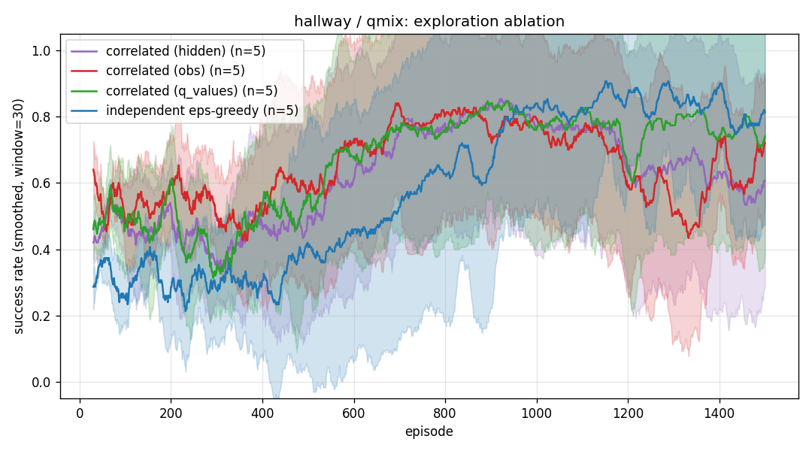
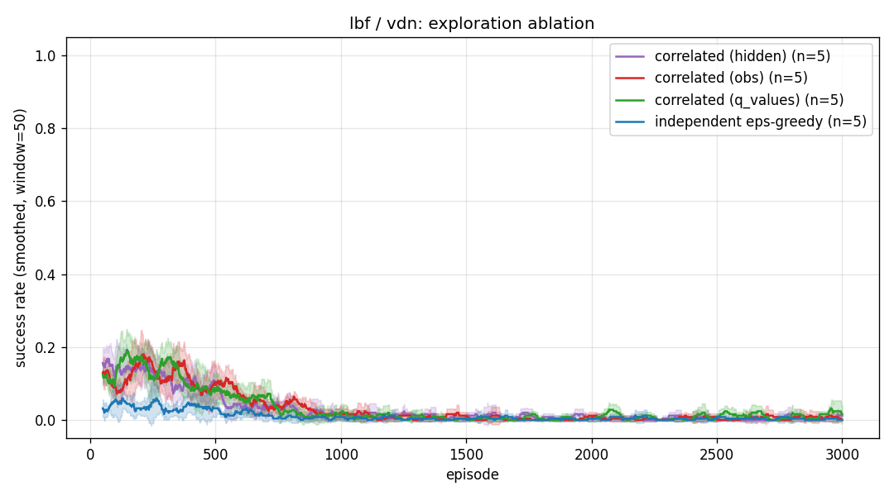
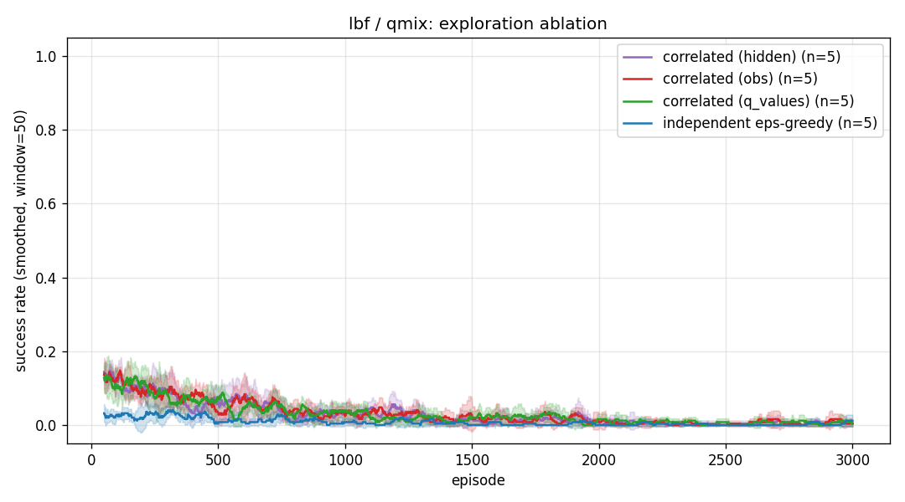
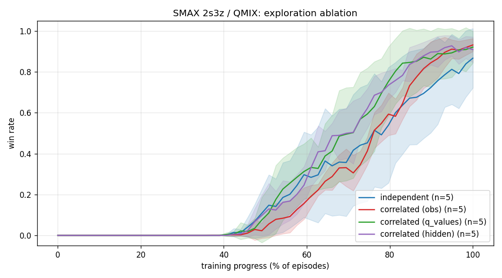
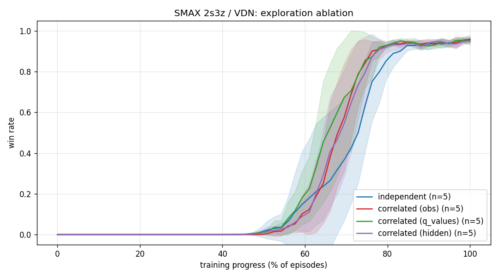
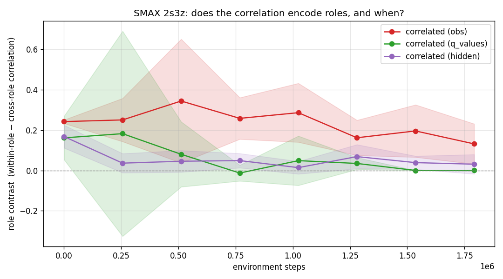
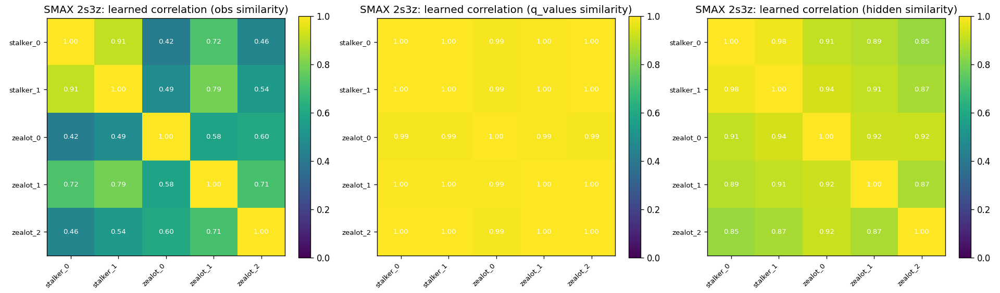

# Correlated Exploration for Cooperative MARL via a Gaussian Copula

**Project 9 — Reinforcement Learning**

## Abstract

In cooperative multi-agent reinforcement learning (MARL), agents must often
*coordinate* their actions to receive any reward at all. Standard
$\varepsilon$-greedy exploration samples each agent's random action
**independently**, which makes the probability of stumbling onto a coordinated
joint action vanish exponentially in the number of agents. We replace
independent $\varepsilon$-greedy with **correlated $\varepsilon$-greedy**: the
random action that exploring agents take is coupled through a Gaussian copula
whose correlation matrix is the cosine similarity of per-agent features, so
similar agents tend to pick the same action.
We evaluate the method on two cooperative benchmarks (a custom *Hallway* and
*Level-Based Foraging*) with two value-decomposition
backbones (VDN and QMIX), and port the method to a GPU-accelerated StarCraft-like
environment (SMAX `2s3z`) implemented in JAX. Correlated exploration produces a
clear early-learning speedup where coordination is the bottleneck (e.g. **+64%
to +94%** relative success in *Hallway* at episodes 50–100) and discovers
**2.6–2.9× more** coordinated successes on the hard *LBF* task, confirming that
the exploration mechanism works even where downstream learning is unstable. On
SMAX `2s3z`, correlated exploration speeds up convergence under VDN and, under
the harder QMIX mixer, **lifts the final win rate from 0.81 to 0.91**; the
`obs`-based correlation couples situationally-similar agents (the two stalkers
most strongly) with no role information supplied.

## 1. Introduction and Hypothesis

We study the *decentralised partially-observable MDP* (Dec-POMDP) setting under
*centralised training, decentralised execution* (CTDE). Each agent $i$ observes
$o_i$ and chooses an action $a_i$; the team receives a single shared reward $r$.

**The coordination problem.** Consider a task that only rewards the team when
all $n$ agents simultaneously take a specific "matching" action. Under
independent $\varepsilon$-greedy, the chance that all $n$ agents explore the
matching joint action in the same step is $\propto \varepsilon^{n}$ — it decays
exponentially with the number of agents. If the agents could instead explore in
a *correlated* way — tending to take "similar" actions at the same time — they
would sample coordinated joint actions far more often.

**Hypothesis.** *Replacing independent $\varepsilon$-greedy with correlated
exploration, where the correlation reflects how similar two agents currently
are, accelerates learning on tasks whose bottleneck is coordination.*

## 2. Method: Correlated Exploration via a Gaussian Copula

We keep the $\varepsilon$-greedy template — with probability $\varepsilon$ an
agent acts randomly, otherwise greedily — but we *correlate which random action
the exploring agents take*. *Who* explores stays an independent Bernoulli (same
exploration budget as the baseline); only the random action is coupled across
agents.

### 2.1 Gaussian copula

A copula lets us impose a desired correlation structure on a set of uniform
random variables while keeping each marginal uniform. The Gaussian copula
construction is:

1. Build a correlation matrix $R \in \mathbb{R}^{n\times n}$ (PSD, unit
   diagonal).
2. Cholesky-factorise $R = LL^\top$.
3. Sample i.i.d. standard normals $z \sim \mathcal{N}(0, I)$ and set
   $y = Lz$, so $y \sim \mathcal{N}(0, R)$.
4. Map through the standard-normal CDF: $u_i = \Phi(y_i)$. Each $u_i$ is now
   uniform on $[0,1]$, but the $u_i$ are *correlated* according to $R$.

An exploring agent then takes the action $\lfloor u_i \cdot |A_i| \rfloor$ (the
$u_i$-indexed action among its $|A_i|$ available actions). Because the $u_i$ are
correlated, agents with high pairwise correlation tend to pick the *same* action
— a coordinated joint action (e.g. both stepping onto switches, or focus-firing
the same enemy). Independent $\varepsilon$-greedy is the special case $R = I$,
where the $u_i$ are independent and the actions are uncorrelated.

### 2.2 Where the correlation matrix comes from

We need a PSD matrix that encodes "how similar are agents $i$ and $j$ right
now". Cosine similarity gives this *for free*: if $f_i$ is a feature vector for
agent $i$ and $\hat f_i = f_i / \lVert f_i \rVert$, then
$R = \hat F \hat F^\top$ is a Gram matrix — automatically PSD, with unit
diagonal. We add a small jitter $\lambda I$ for numerical stability of the
Cholesky factorisation.

We compare three **similarity sources** $f_i$:

- **`obs`** — the agent's (augmented) observation.
- **`q_values`** — the agent's current Q-value vector.
- **`hidden`** — the hidden activation of the Q-network backbone.

This design is *role-agnostic*: nothing in the method knows which agents share a
role. When two agents are in genuinely similar situations, the cosine similarity
is high and they get correlated; when they differ, the correlation drops. On SMAX
`2s3z` (2 stalkers + 3 zealots) this coupling is largely aligned with unit type —
the two stalkers are consistently the most correlated pair — without any role
information being supplied (Section 5.3).

## 3. Experimental Setup

### 3.1 Environments

- **Hallway** (from the MAVEN paper). Two agents sit on separate corridors of
  lengths 3 and 4; each sees only its own position. The team is rewarded only
  when *both* reach position 0 in the same step. Coordination is the entire
  task. 3 actions (left / stay / right).
- **Level-Based Foraging** (`Foraging-5x5-2p-1f-coop-v3`). Two agents must load
  a single food item *together* (cooperative variant). Sparse reward; the
  harder of the two.

### 3.2 Algorithms

We use two value-decomposition backbones, both with **parameter sharing** (one
shared Q-network; agents are disambiguated by a one-hot agent id appended to the
observation):

- **VDN**: $Q_{\text{tot}} = \sum_i Q_i$.
- **QMIX**: a monotonic mixing network whose non-negative weights are produced
  by a hypernetwork conditioned on the global state (`embed_dim=16`,
  `hyper_hidden=32`).

Training uses a DQN-style loop (Adam, `lr=1e-4`, target network synced every
500 steps, $\gamma=0.99$, gradient-norm clipping at 10). On *LBF* only we add a
**balanced replay buffer** that oversamples the rare successful transitions, to
mitigate the extreme reward sparsity. Each configuration is run over **5 seeds**.
Plots show mean ± std of the smoothed success rate.

## 4. Results

### 4.1 Hallway — correlated exploration learns faster (headline result)

Correlated exploration with the **`obs`** similarity source learns markedly
faster in the early phase, exactly when exploration matters most:

| Backbone | Independent (ep 50–100) | Correlated-`obs` (ep 50–100) | Relative |
|---|---|---|---|
| VDN  | 0.348 | **0.572** | +64% |
| QMIX | 0.276 | **0.536** | +94% |

Under QMIX, *all three* correlated variants beat independent early
(`q_values` 0.508, `hidden` 0.488). All methods converge to a high success rate
by the end of training (the task is ultimately easy), so the benefit is a
**speed-up**, not a higher asymptote — which is precisely what the hypothesis
predicts for a coordination-bottlenecked task.

### 4.2 Level-Based Foraging — the mechanism works even where learning fails

*LBF* is dominated by **catastrophic forgetting**: every method climbs to a peak
early and then collapses toward zero as the sparse-reward Q-learning becomes
unstable. However, the *peak* success rate cleanly separates the methods:

| Backbone | Independent (peak) | Best correlated (peak) | Relative |
|---|---|---|---|
| VDN  | 0.092 | **0.236** (`obs`) | 2.6× |
| QMIX | 0.068 | **0.200** (`q_values`) | 2.9× |

Correlated exploration discovers **2.6–2.9× more coordinated successes** before
the collapse. This is an important sanity check: the exploration mechanism is
doing its job (finding joint successes that independent exploration misses); the
failure to *retain* them is a separate problem of value-based learning under
extreme sparsity, not a failure of the exploration scheme.

### 4.3 Which similarity source?

`obs` is the most reliable source — it gives the largest and most consistent
early-learning gain (Hallway) and the highest LBF peak under VDN. `q_values` and
`hidden` help in some configurations but are inconsistent; early in training the
network is random, so its Q-values and hidden states carry little reliable
similarity signal, whereas the raw observation is informative from step one.

## 5. SMAX `2s3z` (StarCraft-like, JAX)

We reimplemented the full method in pure JAX (Flax networks, Optax optimiser)
against the JaxMARL SMAX environment, vectorising 128 parallel environments with
`jax.vmap` (~6900 environment-steps/second on a single RTX 2080 Ti). The `2s3z`
scenario (2 stalkers + 3 zealots vs. a mirrored enemy team) is a genuine
5-agent, two-role coordination task. We ran the same ablation
(VDN/QMIX × independent/`obs`/`q_values`/`hidden` × 5 seeds, 2M env-steps each).

### 5.1 Getting a from-scratch value-based learner to converge

Our first runs did not learn (flat ~0% win rate) because the TD loss **diverged**
to $10^4$–$10^6$ — Q-value explosion, not under-training. Four standard
stabilisers fixed it: Double DQN targets, Polyak soft target updates
($\tau{=}0.005$), $\text{lr}=10^{-4}$, and a `LayerNorm` on the QMIX mixer's
unnormalised global-state input (values up to ~24 otherwise blew up the
`abs()`-weighted hypernetwork). Both backbones then **solve `2s3z` to ~100% win
rate**.

### 5.2 Correlated exploration helps, most on the harder mixer

We report two metrics per configuration (5 seeds): the final win rate (mean over
the last 10% of episodes) and the fraction of training needed to first reach a
50% win rate (lower = faster).

| Backbone | Independent (final / to-50%) | Best correlated (final / to-50%) |
|---|---|---|
| VDN  | 0.95 / 0.70 | 0.95 / **0.66** (`q_values`) |
| QMIX | 0.81 / 0.74 | **0.91** / **0.65** (`hidden`) |

- **VDN** (simple additive mixer) is easy enough that every variant converges to
  the same ~0.95 win rate; correlated exploration just reaches the 50% milestone
  somewhat sooner (≈6% earlier).
- **QMIX** (harder monotonic mixer) is where correlated exploration clearly
  helps: independent plateaus lower (0.81) and with high seed-to-seed variance,
  while the correlated variants reach a **higher and more reliable final win rate
  (0.90–0.91)** and get there faster. The learning curves show all three
  correlated variants tracking above independent through most of training.

This matches the hypothesis: coupling the exploratory actions (here, coordinated
focus-fire) helps most when credit assignment is harder.

### 5.3 When does the correlation encode roles?

The copula recomputes the correlation matrix *live* at every step, and
exploration is most active early in training (high $\varepsilon$). So the
relevant question is not just *whether* but *when* the matrix carries role
structure. As a summary statistic we use a **role-contrast** score
= mean(within-role correlation) − mean(cross-role correlation): positive means
the copula tends to couple same-role agents more than cross-role ones, ~0 means
uniform. (As we discuss below, `obs` actually captures *situational* similarity,
of which role is a major component.)

- **`obs`** keeps a clearly **positive** role contrast throughout training,
  highest in the early-to-mid phase — exactly when $\varepsilon$ is large and
  exploration matters. The raw observation always encodes unit type, so this
  signal is available from step 0 and does not depend on the (initially random)
  network.
- **`q_values`** is **noisy and unreliable** (large variance, dips below zero):
  early it reflects a random network, later it collapses as all agents converge
  to the same focus-fire values.
- **`hidden`** carries only a **weak** contrast — the learned representation does
  not preserve role identity for this purpose.

The end-of-training snapshot makes the collapse concrete:

By convergence `q_values` and `hidden` are near-uniform (~0.95–1.0) — every agent
values the same actions. The `obs` panel is more nuanced: the two stalkers are
consistently the **most strongly coupled pair (~0.9)**, but the partition is not
cleanly by unit type — typically one zealot couples strongly with the stalkers
(~0.7) while the others group separately, and which zealot this is varies across
seeds. This is expected: cosine similarity on the observation measures
**situational** similarity (relative positions, visible enemies, health, last
action), of which unit type is a strong but not exclusive component — a zealot
fighting alongside the stalkers looks situationally like them.

For the method this is arguably the *right* behaviour: correlated exploration
should couple agents that are in **similar situations**, not merely the same
nominal role. The takeaway for the similarity-source comparison still holds —
`obs` provides a stable, interpretable coupling throughout the
exploration-heavy phase, whereas the learned `q_values`/`hidden` features become
uninformative as the policy converges.

## 6. Discussion and Limitations

- **The hypothesis holds where its assumptions hold.** Correlated exploration
  helps most when (a) coordination is the bottleneck and (b) downstream learning
  is stable enough to exploit the discovered successes (*Hallway*). When
  learning itself is unstable (*LBF*), exploration still finds more successes but
  the gain is not retained.
- **`obs` similarity is the safe default.** Learned features (`q_values`,
  `hidden`) are unreliable early in training, exactly when exploration matters.
- **Limitations.** Only 2 agents in the toy tasks; the catastrophic forgetting
  on *LBF* limits the conclusiveness of that benchmark; and the correlation is
  recomputed greedily each step rather than annealed.

## 7. Conclusion

Coupling agents' $\varepsilon$-greedy decisions through a Gaussian copula
parameterised by cosine similarity is a simple, drop-in change that
measurably accelerates cooperative MARL on coordination-bottlenecked tasks
(+64–94% early success on *Hallway*) and demonstrably improves exploration
quality even where value learning fails (2.6–2.9× higher peak on *LBF*). The raw
observation is the most dependable similarity source. The findings transfer to
the larger, two-role, GPU-scale SMAX `2s3z` task, where correlated exploration
speeds up convergence and, under QMIX, raises the final win rate (0.81 → 0.91);
the `obs`-based correlation couples situationally-similar agents (the two
stalkers most strongly) with no role information supplied.

## 8. Use of AI tools

The project was developed with **Claude Code** (Anthropic Claude Opus) as a
pair-programming assistant.

- **What it was used for:** implementing the PyTorch toy-environment MARL stack
  (VDN/QMIX, replay buffers, exploration) and the from-scratch JAX/JaxMARL SMAX
  pipeline; debugging cluster issues (CUDA/cuDNN wheels, multi-process GPU OOM);
  diagnosing training failures; generating figures; and drafting this report.
- **What worked well:** fast iteration on boilerplate; systematic debugging —
  e.g. correctly diagnosing the SMAX Q-value divergence from the loss curve and
  the ~50× `jax.vmap` throughput rewrite.
- **What did not:** several defaults it chose were wrong and needed correction.
  Most importantly, its first SMAX exploration correlated *whether* each agent
  explored rather than *which action* it took — a subtle conceptual bug that only
  surfaced in **human code review**, not from the tool itself. The initial SMAX
  hyper-parameters also diverged. The lesson: the assistant accelerates
  implementation but its output requires careful conceptual verification.

---

### Reproducibility

- Toy benchmarks: `python long_run.py --env {hallway,lbf} --mixer {vdn,qmix} --exploration {independent,correlated} --similarity {obs,q_values,hidden} --seed S`
- Grid: `python run_grid.py ...` (idempotent); plots: `python plot_results.py --env ENV --mixer MIX`.
- SMAX: `python -m smax.run --exploration ... --mixer ... --similarity ... --seed S`; grid via `run_smax_grid.py`.
